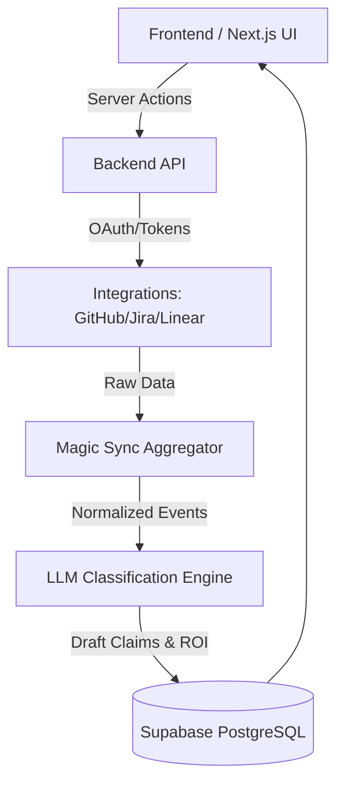

<div align="center">
  
  
  # 🚀 GrantAI
  **The Next-Generation AI R&D Tax Credit Operating System**

  [](https://nextjs.org/)
  [](https://www.typescriptlang.org/)
  [](https://supabase.com/)
  [](https://tailwindcss.com/)
  [](https://opensource.org/licenses/MIT)

  <p align="center">
    Automate, optimize, and secure your R&D tax credit claims with our unified AI engine. 
    <br/><i>Less paperwork. More engineering.</i>
  </p>
</div>

---

## ✨ Overview

**GrantAI** transforms the tedious, manual process of claiming R&D tax credits into a seamless, automated pipeline. By deeply integrating with your existing engineering tools, our platform uses advanced LLMs to identify qualifying R&D activities, generate robust technical justifications, and calculate precise ROI forecasts across multiple global tax jurisdictions (WBSO, CIR, HMRC, and more).

## 💡 Key Features

- 🔮 **Unified Magic Sync**  
  One-click synchronization with **GitHub, Jira, and Linear**. We ingest commits, PRs, and tickets to build a holistic timeline of your engineering efforts.

- 🧠 **AI Classification Engine**  
  Our proprietary 2-pass LLM pipeline automatically analyzes your data against strict legal frameworks, identifying *technological uncertainty* and *scientific advancement*.

- 🌍 **Multi-Jurisdiction Support**  
  Built-in rule registries for **🇳🇱 WBSO, 🇬🇧 HMRC, 🇫🇷 CIR, 🇩🇪 Forschungszulage**, and others.

- 💳 **Dual-Provider Billing**  
  Seamless subscription management supporting both fiat (**Stripe**) and cryptocurrency (**NOWPayments**).

- 🛡️ **Enterprise-Grade Security**  
  Role-Based Access Control (RBAC), multi-tenant workspaces, and immutable audit trails for every R&D claim.

---

## 🛠️ Technology Stack

| Category          | Technology                                                                 |
| ----------------- | -------------------------------------------------------------------------- |
| **Frontend**      | Next.js 14 (App Router), React, TypeScript                                |
| **Styling**       | Tailwind CSS, Framer Motion, Lucide Icons                                  |
| **Backend**       | Next.js API Routes, Server Actions, Node.js                               |
| **Database**      | PostgreSQL (Supabase), Prisma ORM                                          |
| **Auth**          | NextAuth.js (Session management, RBAC)                                     |
| **AI/LLM**        | DeepSeek / OpenAI via specialized `rd-engine` pipelines                    |
| **Integrations**  | GitHub API, Jira API, Linear API                                           |

---

## 🚀 Getting Started

### Prerequisites

- Node.js >= 18.x
- npm >= 9.x
- A running Supabase instance

### Local Development

1. **Clone the repository**
   ```bash
   git clone https://github.com/your-org/grantai.git
   cd grantai
   ```

2. **Install dependencies**
   ```bash
   cd frontend
   npm install
   ```

3. **Environment Setup**
   Copy the example environment file and populate your keys:
   ```bash
   cp .env.example .env
   ```
   *(Ensure you have your `DATABASE_URL`, `DIRECT_URL`, `NEXTAUTH_SECRET`, Stripe, and LLM API keys configured).*

4. **Database Setup**
   Push the Prisma schema to your database:
   ```bash
   npx prisma db push
   npx prisma generate
   ```

5. **Start the Development Server**
   ```bash
   npm run dev
   ```
   Open [http://localhost:3000](http://localhost:3000) to view the application.

---

## 🏗️ Architecture



---

## 🔒 Security & Compliance

GrantAI treats your intellectual property with the utmost respect. 
- **No training:** Your source code and tickets are *never* used to train our AI models.
- **Audit Trails:** Every claim generation step, modification, and user action is permanently logged via the `AuditLog` subsystem for tax authority reviews.

---

<div align="center">
  <b>Built with ❤️ by the GrantAI Engineering Team</b>
</div>
